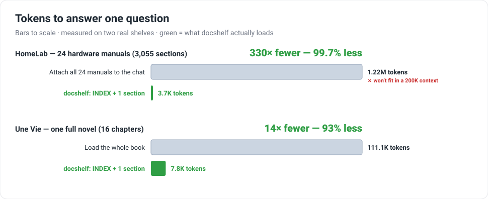

# Does the docshelf pattern actually save tokens?

The [README](https://github.com/ignatenkofi/docshelf-mcp) explains the
*mechanism* — hand the model a tiny `INDEX.md`, let it fetch only the one
section it needs. This page measures whether the mechanism actually pays off,
on **two real shelves**:

- **HomeLab** — [`ignatenkofi/gh.project.homelab`](https://github.com/ignatenkofi/gh.project.homelab):
  24 hardware manuals (routers, motherboards, PSUs, a NAS…), split into 3,055
  sections. Includes the full MikroTik RouterOS manual — ~1.05M tokens on its
  own.
- **Une Vie** — [`ignatenkofi/UneVieShelf`](https://github.com/ignatenkofi/UneVieShelf):
  one full novel (Maupassant's *Une Vie*), split into 16 chapters.



## The numbers

To answer a question whose answer lives in **one section of one document**, an
LLM can (A) dump the whole collection into context, (B) load the whole
containing manual, or (C) do it the docshelf way — read `INDEX.md`, then fetch
just that section.

| Shelf | Docs / sections | `INDEX.md` | Whole collection (A) | Biggest document (B) | **docshelf: INDEX + 1 section (C)** | Savings |
|---|---|---|---|---|---|---|
| **HomeLab** | 24 / 3,055 | 3.5K | **1.22M** | 1.05M (RouterOS) | **3.7K** | **99.7%** vs collection |
| **Une Vie** | 1 / 16 | 0.7K | 111K | 111K | **7.8K** | **93%** vs the book |

Two things stand out:

- **The naive approaches often don't even fit.** Dumping the HomeLab
  collection (1.22M tokens) overflows a 1M-token context window; the RouterOS
  manual alone (1.05M) overflows a 200K window five times over. The docshelf
  query is **3.7K tokens** — it fits with room to spare, every time.
- **Savings scale with the collection.** The more (or bigger) the documents,
  the larger the win — because the docshelf cost stays flat: `INDEX` + one
  section, regardless of how much sits behind the index.

## Methodology

- **What's counted.** For each shelf: `INDEX.md`, every full document, and
  every split section. The "docshelf query" is `tokens(INDEX) +
  tokens(median section)` — one index read plus one section fetch. "Whole
  collection" is the sum of the full documents; "biggest document" is the
  largest single one.
- **The result is robust, not cherry-picked.** The win comes from the *index*,
  not from picking a tiny section: even if the model fetched five sections
  instead of one, the HomeLab query would be ~4.3K tokens — still **99.6%**
  below dumping the collection. The headline barely moves.
- **Token counting.** Network-free by default, using OpenAI's published rule of
  thumb of ~4 characters per token. Because all three measures use the *same*
  counter, **the tokenizer cancels out of the savings percentages** — the
  ratios are estimator-independent; only the absolute counts move (±10-20%)
  between tokenizers. Pass `--tiktoken` for exact GPT (`cl100k_base`) counts.
- **Honest framing.** These are reproducible *measurements* of the two repos
  above, not telemetry from live chat sessions. They quantify the ingestion
  cost of the retrieval step — the part docshelf changes — not end-to-end
  answer quality.

## Reproduce it (on these shelves, or your own)

```bash
git clone https://github.com/ignatenkofi/docshelf-mcp
python docshelf-mcp/benchmarks/token_savings.py /path/to/your/shelf
# exact GPT tokens instead of the estimate:
python docshelf-mcp/benchmarks/token_savings.py --tiktoken /path/to/your/shelf
```

Point it at any shelf (a directory with an `INDEX.md` and a `docs/` tree) to
get your own numbers. The script and the chart generator live in
[`benchmarks/`](https://github.com/ignatenkofi/docshelf-mcp/tree/main/benchmarks).

---

*Back to the [docshelf-mcp landing page](index.md) ·
[repo](https://github.com/ignatenkofi/docshelf-mcp).*
